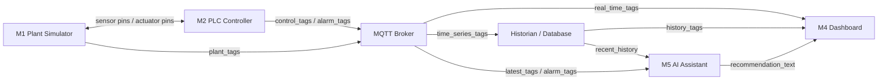
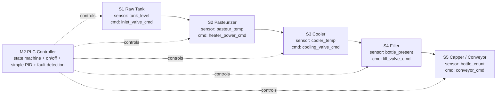

# Smart Beverage Pasteurization and Bottling Line Digital Twin

This repository contains a digital twin of a smart beverage pasteurization and bottling line. The system is organized like an RTL-style modular design: each module has clear input pins, output pins, and a defined responsibility.

## 1. System Assumption

| Item | Value |
|---|---|
| System state update period | 1 s |

## 2. Top-Level Architecture



Key rule: the closed-loop control path is only between **M1 Plant Simulator** and **M2 PLC Controller**. The AI assistant recommends operator actions but does not directly control actuators.

## 3. Module Summary

| Module | Main input pins | Main output pins | Responsibility |
|---|---|---|---|
| M1 Plant Simulator | `actuator_cmd_*`, `fault_inject_code`, `reset_fault` | `sensor_*`, `feedback_*`, `stage_state`, `fault_status` | Simulate the physical beverage line and fault behavior. |
| M2 PLC Controller | `sensor_*`, `feedback_*`, `operator_start`, `operator_stop` | `actuator_cmd_*`, `alarm_code`, `plc_state` | Run control logic, state machine, and fault detection. |
| M3 Data Layer | `plant_tags`, `control_tags`, `alarm_tags` | `real_time_tags`, `history_tags`, `data_stale_flag` | Transfer tags through MQTT and store history in a historian/database. |
| M4 Dashboard | `real_time_tags`, `history_tags`, `recommendation_text` | `operator_start`, `operator_stop`, `fault_inject_code`, `reset_fault` | Display live status, trends, alarms, and fault-injection controls. |
| M5 AI Assistant | `latest_tags`, `alarm_code`, `recent_history` | `recommendation_text`, `diagnosis_label`, `confidence_level` | Explain alarms and recommend operator actions. |

## 4. M1 Plant Simulator Port Specification

```text
module M1_PlantSimulator (
    input  pump_cmd,
    input  inlet_valve_cmd,
    input  heater_power_cmd,
    input  cooling_valve_cmd,
    input  conveyor_cmd,
    input  fill_valve_cmd,
    input  capper_cmd,
    input  fault_inject_code,
    input  reset_fault,
    output tank_level,
    output pasteur_temp,
    output cooler_temp,
    output flow_rate,
    output bottle_present,
    output bottle_count,
    output pump_feedback,
    output valve_feedback,
    output stage_state,
    output fault_status
);
```

## 5. M2 PLC Controller Port Specification

```text
module M2_PLCController (
    input  tank_level,
    input  pasteur_temp,
    input  cooler_temp,
    input  flow_rate,
    input  bottle_present,
    input  pump_feedback,
    input  valve_feedback,
    input  operator_start,
    input  operator_stop,
    output pump_cmd,
    output inlet_valve_cmd,
    output heater_power_cmd,
    output cooling_valve_cmd,
    output conveyor_cmd,
    output fill_valve_cmd,
    output capper_cmd,
    output alarm_code,
    output plc_state
);
```

## 6. M3-M5 Port Specifications

### M3 Data Layer

```text
module M3_DataLayer (
    input  plant_tags,
    input  control_tags,
    input  alarm_tags,
    output real_time_tags,
    output history_tags,
    output data_stale_flag
);
```

### M4 Dashboard

```text
module M4_Dashboard (
    input  real_time_tags,
    input  history_tags,
    input  recommendation_text,
    output operator_start,
    output operator_stop,
    output fault_inject_code,
    output reset_fault
);
```

### M5 AI Assistant

```text
module M5_AIAssistant (
    input  latest_tags,
    input  alarm_code,
    input  recent_history,
    output recommendation_text,
    output diagnosis_label,
    output confidence_level
);
```

## 7. M1 and M2 Design

### 7.1 Pipeline



### 7.2 Stage Pin Definition

| Stage | M1 output sensor pins | M2 output command pins | Normal control meaning |
|---|---|---|---|
| S1 Raw Tank | `tank_level`, `flow_rate` | `inlet_valve_cmd`, `pump_cmd` | Low level opens inlet; high level closes inlet. |
| S2 Pasteurizer | `pasteur_temp`, `flow_rate` | `heater_power_cmd`, `pump_cmd` | Temperature below setpoint increases heater power. |
| S3 Cooler | `cooler_temp` | `cooling_valve_cmd` | High temperature opens cooling valve. |
| S4 Filler | `bottle_present`, `fill_level_est` | `fill_valve_cmd` | Bottle present opens filling valve for a fixed time. |
| S5 Capper / Conveyor | `bottle_count`, `capper_feedback` | `conveyor_cmd`, `capper_cmd` | Conveyor moves bottles and capper closes bottles. |

### 7.3 Fault Injection and Detection Pins

| Case | Fault injection pin | Observed abnormal pins | M2 alarm output |
|---|---|---|---|
| Normal | `fault_inject_code = 0` | Sensor and feedback pins follow commands. | `alarm_code = 0` |
| Sensor fault | `fault_inject_code = TEMP_STUCK` | `pasteur_temp` is frozen while `heater_power_cmd` changes. | `alarm_code = SENSOR_TEMP_STUCK` |
| Equipment fault | `fault_inject_code = PUMP_FAIL` | `pump_cmd = 1`, but `pump_feedback = 0` and `flow_rate = 0`. | `alarm_code = PUMP_NO_FLOW` |
| Process fault | `fault_inject_code = TEMP_EXCURSION` | `pasteur_temp` is outside safe range for multiple update cycles. | `alarm_code = TEMP_OUT_OF_RANGE` |
| Infrastructure fault | `fault_inject_code = MQTT_STALE` | `data_stale_flag = 1` or tag timestamp is too old. | `alarm_code = DATA_STALE` |

## 8. Suggested Repository Structure

```text
README.md
simulator/
plc/
messaging/
historian/
dashboard/
ai_assistant/
requirements.txt
```

## 9. Demo Plan

1. Start the plant simulator.
2. Start the PLC controller.
3. Start the MQTT broker and historian.
4. Start the dashboard.
5. Start the AI assistant.
6. Run normal operation.
7. Inject each fault through `fault_inject_code`.
8. Confirm that the dashboard shows the alarm and AI recommendation.
